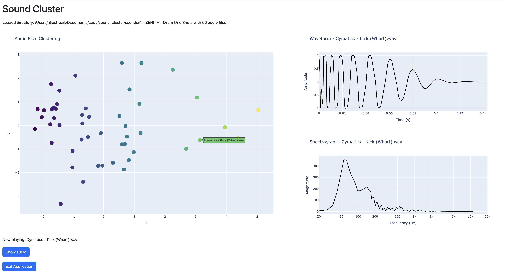
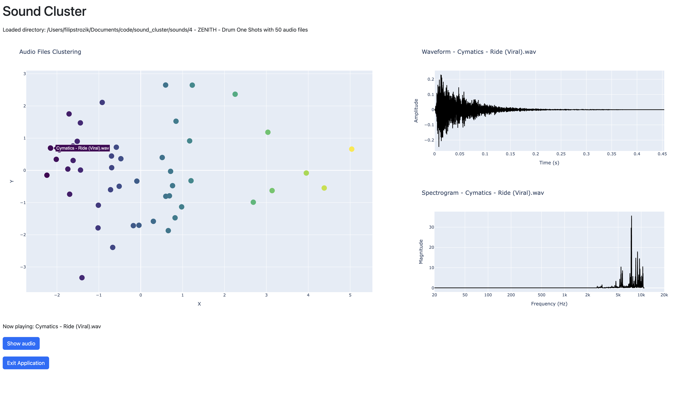
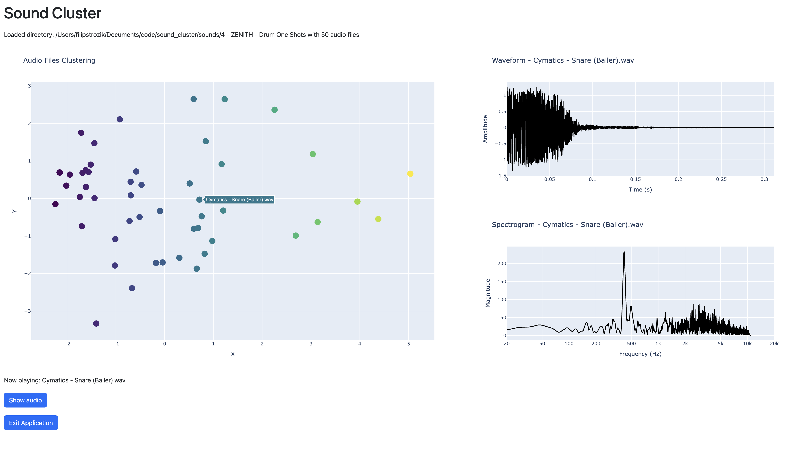

# Sound Cluster

Sound Cluster is an interactive audio analysis and visualization tool built with Python, Dash, and Plotly. It allows users to select a directory of audio files, analyze their features, and visualize them in a 2D PCA cluster plot. Users can click on samples to play them, view their waveform and spectrogram, and locate the files on disk.

## Screenshots





## Features

- Select a directory containing audio files (WAV, MP3, FLAC, OGG, M4A)
- Automatic extraction of audio features using librosa
- 2D PCA clustering of audio files
- Interactive scatter plot for exploring clusters
- Click on a sample to play audio, view waveform and spectrogram
- Always shows spectrogram frequency axis from 20 Hz to 20 kHz (log scale)
- Locate audio files in the file explorer
- Clean, static, and user-friendly web interface

## Requirements

- Python 3.8+
- See `requirements.txt` for dependencies (Dash, Plotly, librosa, numpy, pandas, scikit-learn, pygame, etc.)

## Usage

1. Install dependencies:
   ```bash
   pip install -r requirements.txt
   ```
2. Run the directory chooser:

   ```bash
   python choose_dir.py
   ```

   This will open a dialog to select your audio folder and launch the Dash web app in your browser.

3. Explore your audio collection:
   - Click on points in the cluster plot to play audio and view details.
   - Use the "Show audio" button to reveal the file in your file explorer.
   - Use the "Exit Application" button to close the app.

## Project Structure

- `choose_dir.py` — GUI for selecting the audio directory and launching the app
- `sound_cluster.py` — Main Dash app for visualization and interaction
- `audio_analyzer.py` — Audio feature extraction and plotting logic

## Author

Created by @filipstrozik
